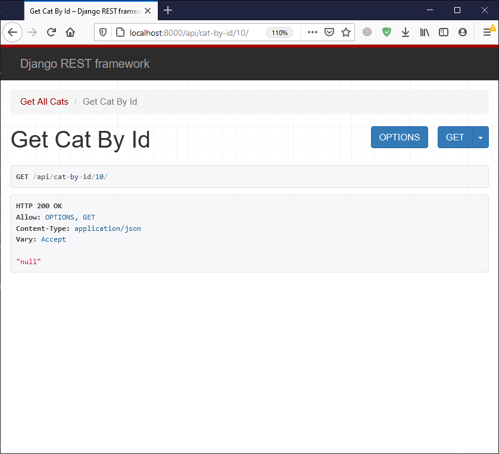
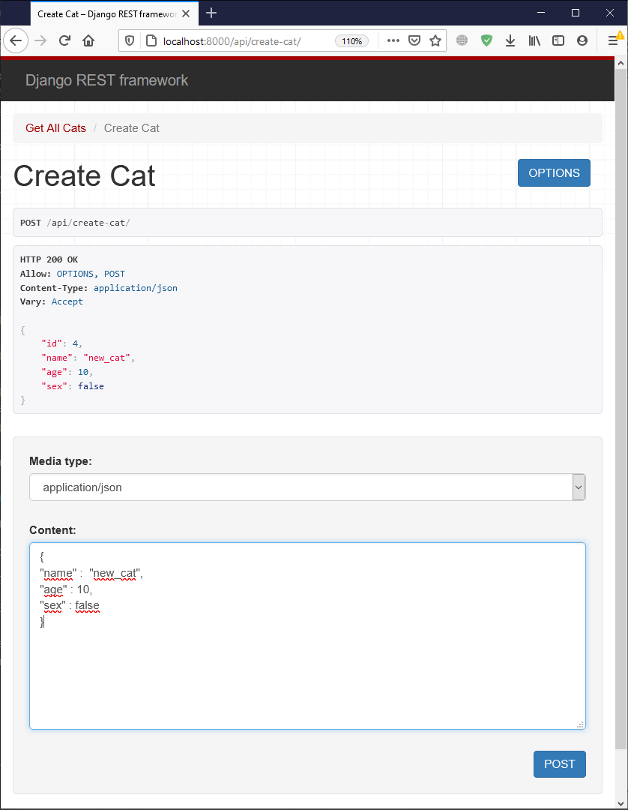
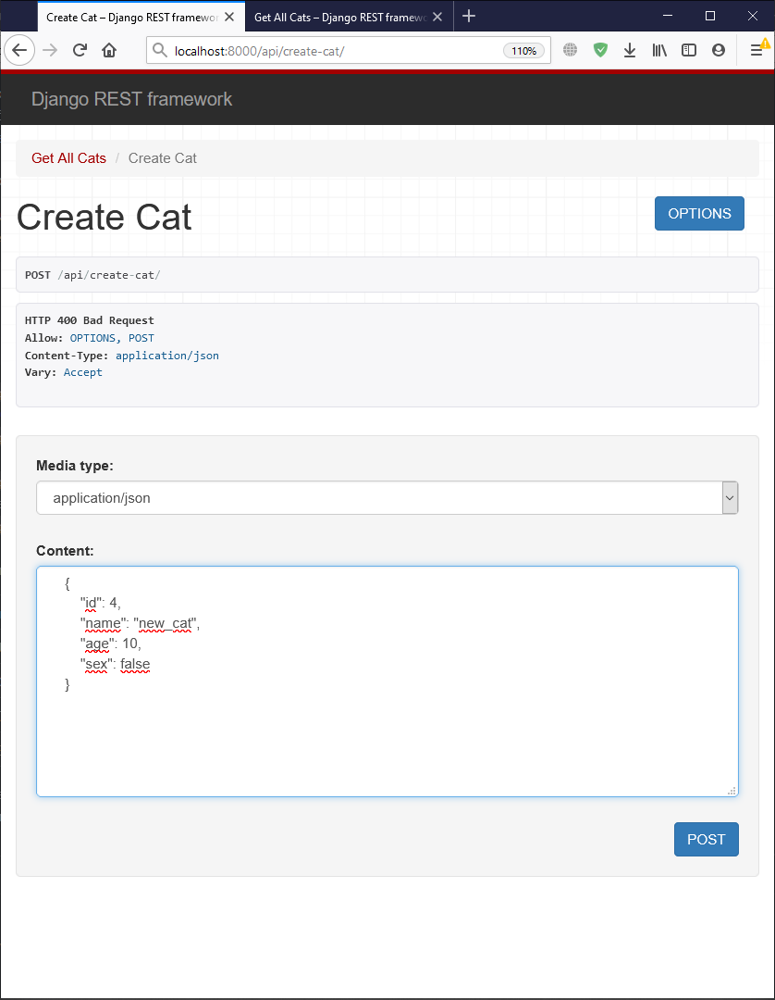
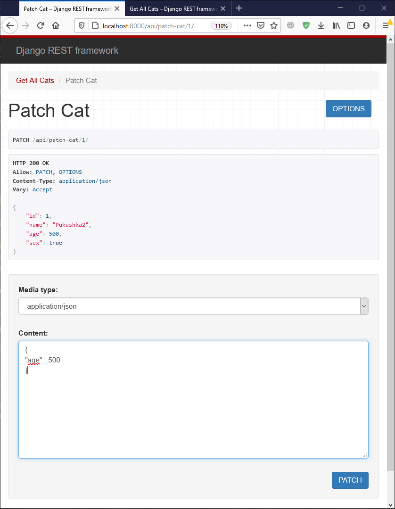
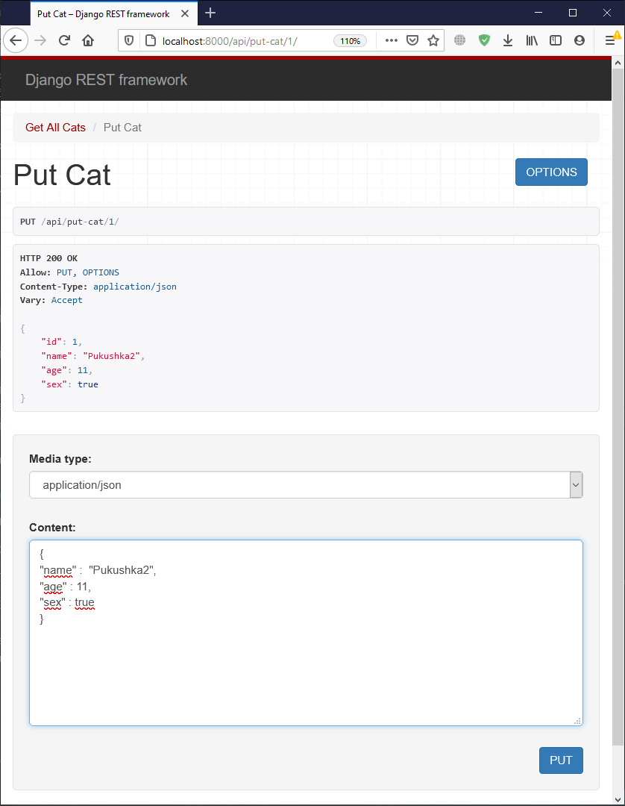
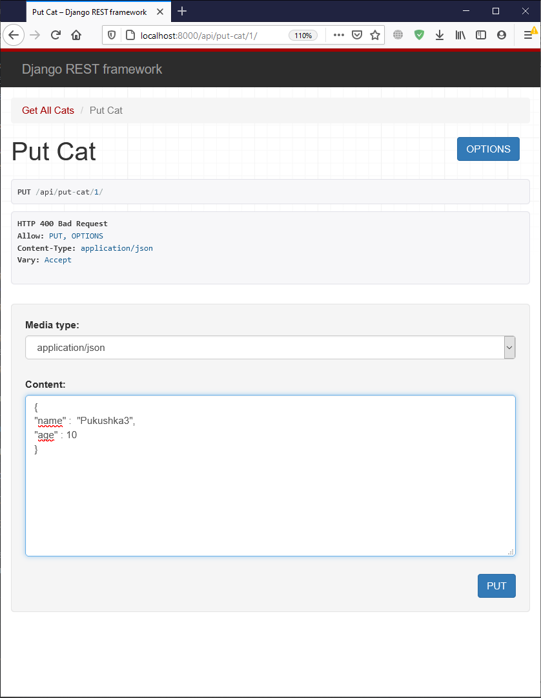

# web-labs
7 семестр, веб-программирование

[Описание лабораторных работ](https://github.com/unvir/Web-programming-course-autumn-2020)

# Stack

* Python 3.9.1
* django 3.1.5
* django-allauth 0.44.0
* djangorestframework 3.12.2

# Лабораторная работа №2 результаты:

# Лабораторная работа №3 результаты:

### ***На всех скриншотах запрос указан в первом блоке на странице, тело запроса в  последнем поле для ввода, результат запроса показан во втором блоке на скриншоте.***

В базу данных, которая находится в lab3/ добелено 4 кота.

### GET

Метод GET реализован для получения всех объектов Cat, объекта по id и объектом с определенным именем. На изображении ниже показана работа GET для получения объекта по id (запрос с корректным и не корректным id).

 

### POST

Корректный ответ при создании объекта и ответ при попытке создания существующего объекта.

### PATCH

Корректный ответ и ответ при попытке обновить не существующий объект

### PUT

Ответ при корректном запросе и при попытке передать не все поля объекта

